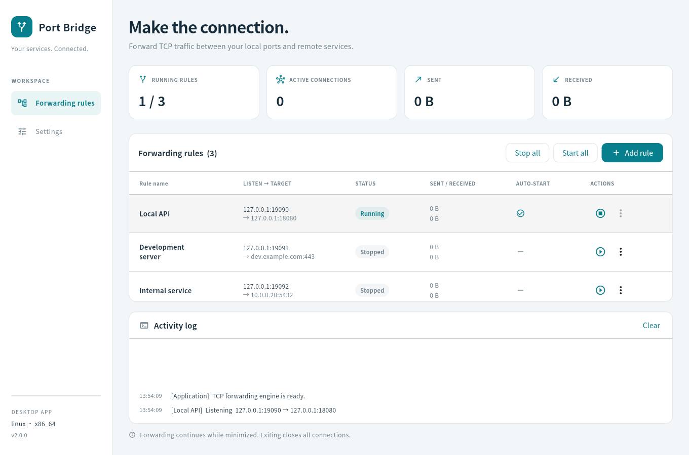

# Port Bridge

English | [简体中文](README.zh-CN.md)

A lightweight desktop application for managing TCP port forwarding. Connect local listening ports to remote services, manage several routes in one place, and inspect connection activity without writing forwarding commands.

Port Bridge is implemented entirely in **Flutter and Dart**. Python is no longer required.



## Features

- Create, edit and remove named TCP forwarding rules.
- Start or stop individual rules, or all rules together.
- IPv4/IPv6 listeners and IP address or hostname targets.
- Live connection counts, traffic totals and activity logs.
- Light, dark or system theme, with teal, blue, violet or amber accents; preferences apply immediately and persist.
- English by default; switch to Simplified Chinese in Settings without restarting forwarding.
- Optional minimize to tray and configurable close-button behavior (minimize or exit).
- Optional startup at desktop login and automatic activation of selected rules.
- Existing version-1 rule files and language preferences remain compatible.

The forwarding engine runs in a separate Dart isolate. It supports TCP half-close, bounded buffering and up to 512 concurrent connections per rule. It forwards raw TCP; it does not add TLS, authentication, UDP forwarding or an HTTP/SOCKS proxy protocol.

## Platforms and architectures

| Platform | Architectures | Build requirements |
| --- | --- | --- |
| Windows 10/11 | x86_64, arm64 | Flutter and Visual Studio with Desktop development with C++ |
| macOS 12+ | x86_64, arm64 | Flutter, Xcode and command-line tools |
| Linux desktop | x86_64, arm64 | Flutter, Clang, CMake, Ninja, pkg-config, GTK 3 development files |

Build on the matching operating system and CPU. CI has separate jobs for all six combinations. Artifact names distinguish `x86_64` from `arm64`; ARM32 is not a supported target. macOS may produce a universal app, but the artifact suffix identifies the build/test host. Intel macOS support also depends on the selected Flutter/Xcode versions.

Ubuntu and Debian are the primary Linux targets. Fedora, openSUSE and other GTK 3/glibc desktop distributions can build from source with equivalent development packages. A binary built on a newer glibc may not run on an older distribution; build on the oldest distribution you intend to distribute to. See Flutter's [supported platforms](https://docs.flutter.dev/reference/supported-platforms) and [desktop setup](https://docs.flutter.dev/platform-integration/desktop).

## Run from source

Install Flutter **3.47.2** and the native desktop toolchain, then run:

```sh
flutter doctor -v
flutter pub get
flutter run -d windows
# Or: flutter run -d macos
# Or: flutter run -d linux
```

Linux development packages (Ubuntu/Debian):

```sh
sudo apt install clang cmake ninja-build pkg-config libgtk-3-dev libayatana-appindicator3-dev libglib2.0-bin liblzma-dev
```

Linux ARM64 has no preassembled stable SDK archive for the pinned release. Bootstrap the SDK from the official source on an ARM64 host:

```sh
git clone --depth 1 --branch 3.47.2 https://github.com/flutter/flutter.git flutter-sdk
export PATH="$PWD/flutter-sdk/bin:$PATH"
flutter doctor -v
```

Use a desktop session. On a headless Linux test host, install `xvfb` and `xauth` to run the compiled smoke test.

## Usage

1. Choose **Add rule**, enter a name, listen address/port and target address/port.
2. Start the rule. Clients connecting to the listener will be forwarded to the target.
3. Open **Settings** to choose English or 简体中文 and configure desktop login startup.

`127.0.0.1` accepts local connections only. `0.0.0.0` listens on all IPv4 interfaces; `::` listens on IPv6 interfaces. Choose an interface appropriate for the intended clients and firewall configuration. Minimize to keep forwarding. Settings controls whether minimizing hides the window in the tray and whether Close minimizes or exits. Minimization uses the taskbar by default. On the first Close, choose Exit or Minimize; the choice is saved and can be changed in Settings. Cancel keeps the window open and asks again next time. Older configurations without a confirmed choice are also prompted once; the tray menu always offers Show window and Exit application. The Settings page also provides an explicit Exit application button, including when the tray is disabled. Exiting closes every connection. Stop a running rule before editing or deleting it.

Linux tray integration needs a StatusNotifier/AppIndicator host. GNOME may need the [AppIndicator extension](https://pub.dev/packages/tray_manager#not-showing-in-gnome). If a tray host is unavailable or initialization fails, the window stays accessible in the taskbar.

## Build a distributable

```sh
flutter pub get
dart run tool/build.dart --target-arch x86_64
# On an ARM64 host: dart run tool/build.dart --target-arch arm64
```

Release versions use `0.x.x` (current: `0.2.2`). The build script checks that `pubspec.yaml` and the application version match.

The script compiles a release build and writes it to `dist/`. Windows produces an **installation-free directory**, such as `port-bridge-0.2.2-windows-x86_64/`. Open that folder and double-click `port_bridge.exe`; no installer, archive extraction, Python/Dart installation or administrator rights are required. Keep the adjacent DLLs and `data` folder together with the EXE when moving or distributing the application. The bundle includes the Flutter libraries, assets and app-local Visual C++ runtime. Windows code signing is not configured.

Linux produces `.deb`, `.rpm` and installation-free `.tar.gz` packages. macOS produces `.dmg` and `.tar.gz` packages. Both platforms have separate `x86_64` and `arm64` artifacts, for example `port-bridge-0.2.2-linux-arm64.deb`. Archives include the complete bundle, license, documentation and `build-info.json`; extract the whole archive and keep the adjacent Flutter libraries and data. macOS distribution signing/notarization is not configured. See [package installation and build instructions](docs/packages.md) for dependencies and supported formats.

Launch `port_bridge.exe` on Windows, `Port Bridge.app` on macOS or `./port_bridge` on Linux. Keep the application in a stable folder before enabling login startup. Close the application before replacing its complete directory during upgrades. If you move the directory, disable and re-enable login startup to update its path. The Linux `.desktop` template requires the executable on PATH or an absolute `Exec` path before installing it into your application menu.

Use `--output-root dist/next` to build into a separate output folder while another build is running. Windows native window/tray behavior can be checked with `./tool/verify_window_behavior.ps1 -Executable <path-to-port_bridge.exe>` in an interactive desktop session.

## Configuration and upgrading

| Platform | Default configuration folder |
| --- | --- |
| Windows | `%APPDATA%/port-bridge` |
| macOS | `~/Library/Application Support/port-bridge` |
| Linux | `~/.config/port-bridge` |

`XDG_CONFIG_HOME` overrides the base directory on every platform. Existing Windows/macOS configurations under `~/.config/port-bridge` are reused when the native location is empty. `rules.json` retains the version-1 schema; `settings.json` retains the `en` and `zh_CN` language codes. Invalid files are reported rather than silently overwritten.

Close the old Python application before opening the Flutter version. After placing the Flutter application in its final folder, toggle login startup off and on to replace any old Python launcher. Existing Python code remains available in Git history.

## Development

```sh
dart format lib test tool
flutter analyze
flutter test
flutter build linux --release
xvfb-run -a build/linux/x64/release/bundle/port_bridge --smoke-test
xvfb-run -a dart run tool/verify_desktop.dart build/linux/x64/release/bundle/port_bridge
```

Tests exercise real network transfers, TCP half-close, slow receivers, connection cleanup, isolate commands, configuration compatibility, startup entries and bilingual UI workflows. The smoke-test flag uses temporary configuration and exits automatically.

See [architecture and the Dart decision](docs/architecture.md) for implementation boundaries and packaging details.
