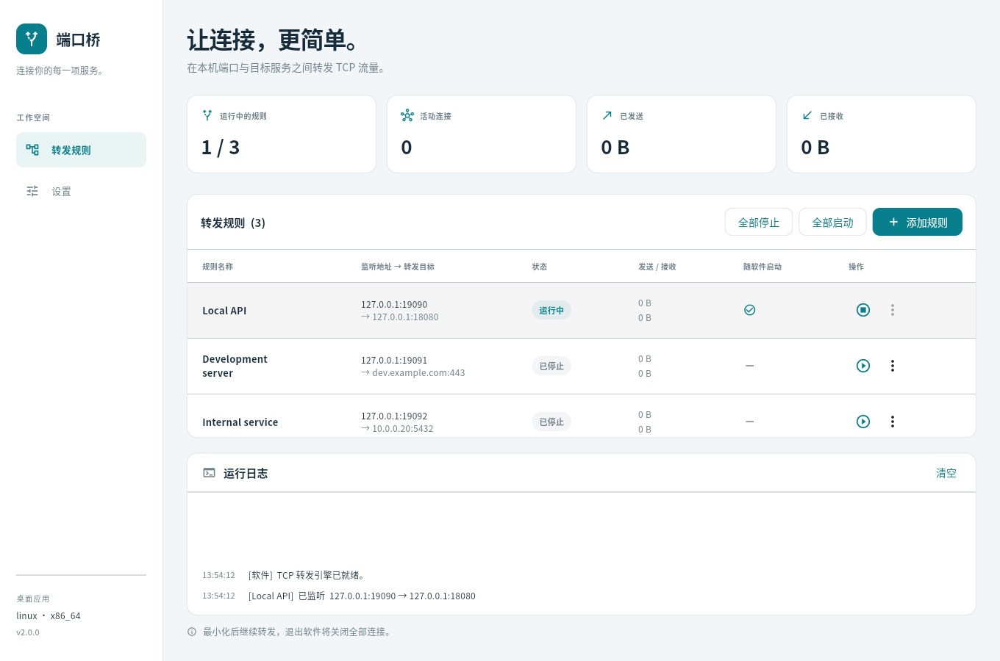

# Port Bridge

[English](README.md) | 简体中文

一个用于管理 TCP 端口转发的轻量桌面应用。将本地监听端口连接到目标服务，在一个界面中管理多条转发规则并查看连接活动，无需手动编写转发命令。

Port Bridge 2 完全使用 **Flutter 与 Dart** 实现，不再需要 Python 运行时。



## 功能

- 添加、编辑和删除命名的 TCP 转发规则。
- 单独或批量启动、停止转发。
- 支持 IPv4/IPv6 监听，目标可填写 IP 地址或主机名。
- 实时查看连接数、传输量和活动日志。
- 默认英文，可在设置中切换简体中文，无需重启转发。
- 可选桌面登录启动，以及随应用自动启动指定规则。
- 兼容旧版 version-1 规则文件和语言偏好。

转发引擎在独立的 Dart isolate 中运行，支持 TCP 半关闭、有界缓冲和每条规则最多 512 个并发连接。软件执行原始 TCP 转发，不添加 TLS、身份认证、UDP 转发或 HTTP/SOCKS 代理协议。

## 平台与架构

| 平台 | 架构 | 构建要求 |
| --- | --- | --- |
| Windows 10/11 | x86_64、arm64 | Flutter、Visual Studio 的“使用 C++ 的桌面开发”组件 |
| macOS 12+ | x86_64、arm64 | Flutter、Xcode 和命令行工具 |
| Linux 桌面 | x86_64、arm64 | Flutter、Clang、CMake、Ninja、pkg-config、GTK 3 开发文件 |

请在对应操作系统与 CPU 上构建。CI 为六种组合分别配置任务，产物名称明确区分 `x86_64` 与 `arm64`，不支持 ARM32。macOS 可能生成通用二进制，但产物后缀表示构建和测试主机的架构。Intel macOS 支持还取决于使用的 Flutter/Xcode 版本。

Linux 主要面向 Ubuntu 和 Debian；Fedora、openSUSE 等提供 GTK 3/glibc 桌面环境的发行版可安装对应开发依赖后从源码构建。较新 glibc 上生成的二进制不一定兼容旧发行版，发布时应在计划支持的最旧发行版上构建。参见 Flutter 的[平台支持范围](https://docs.flutter.dev/reference/supported-platforms)和[桌面环境配置](https://docs.flutter.dev/platform-integration/desktop)。

## 从源码运行

安装 Flutter **3.47.2** 和对应桌面编译工具链后执行：

```sh
flutter doctor -v
flutter pub get
flutter run -d windows
# 或：flutter run -d macos
# 或：flutter run -d linux
```

Ubuntu/Debian 开发依赖：

```sh
sudo apt install clang cmake ninja-build pkg-config libgtk-3-dev liblzma-dev
```

固定的 Flutter 版本没有预组装的 Linux ARM64 稳定版 SDK 压缩包，可在 ARM64 主机上从官方源码引导安装：

```sh
git clone --depth 1 --branch 3.47.2 https://github.com/flutter/flutter.git flutter-sdk
export PATH="$PWD/flutter-sdk/bin:$PATH"
flutter doctor -v
```

运行应用需要桌面会话。无显示器的 Linux 测试主机可以安装 `xvfb` 和 `xauth`，运行编译后的冒烟测试。

## 使用

1. 点击“添加规则”，填写名称、监听地址与端口、目标地址与端口。
2. 启动规则。连接监听端口的客户端流量将被转发到目标。
3. 在“设置”中选择 English 或简体中文，并配置桌面登录启动。

`127.0.0.1` 仅接受本机连接；`0.0.0.0` 监听所有 IPv4 接口；`::` 监听 IPv6 接口。根据目标客户端与防火墙配置选择监听接口。最小化后继续转发，退出则关闭所有连接。编辑或删除运行中的规则前需要先停止。

## 构建发布包

```sh
flutter pub get
dart run tool/build.dart --target-arch x86_64
# ARM64 主机使用：dart run tool/build.dart --target-arch arm64
```

脚本编译 release 版本并输出到 `dist/`。Windows 输出**免安装目录**，例如 `port-bridge-2.0.0-windows-x86_64/`。打开目录，双击 `port_bridge.exe` 即可，无需安装、解压压缩包、安装 Python/Dart 或使用管理员权限。移动或分发应用时，请保留 EXE 旁边的 DLL 和 `data` 文件夹。目录已包含 Flutter 库、资源与 Visual C++ 运行库。Windows 代码签名尚未配置。

macOS 与 Linux 使用 tar.gz，例如 `port-bridge-2.0.0-linux-x86_64.tar.gz`。压缩包包含完整应用、说明文档与 `build-info.json`，请完整解压，这些平台的执行文件仍依赖旁边的 Flutter 库和数据。macOS 发布签名与公证尚未配置。

Windows 双击 `port_bridge.exe`，macOS 打开 `Port Bridge.app`，Linux 执行 `./port_bridge`。启用登录启动前，请将应用放在固定目录。升级时请先退出应用，再替换完整目录；移动目录后需要关闭并重新打开登录启动设置。Linux 的 `.desktop` 模板在安装到应用菜单前，需要将程序加入 PATH 或将 `Exec` 改为绝对路径。

## 配置与升级

| 平台 | 默认配置目录 |
| --- | --- |
| Windows | `%APPDATA%/port-bridge` |
| macOS | `~/Library/Application Support/port-bridge` |
| Linux | `~/.config/port-bridge` |

所有平台均支持使用 `XDG_CONFIG_HOME` 覆盖基础目录。Windows/macOS 的原生目录没有配置时，会继续使用已有的 `~/.config/port-bridge`。`rules.json` 保持 version-1 格式，`settings.json` 保持 `en` 和 `zh_CN` 语言代码；损坏的文件会显示错误，不会被静默覆盖。

升级前先退出旧版 Python 应用。将 Flutter 应用放入最终目录后，关闭并重新开启登录启动，以替换旧版 Python 启动项。旧版源码仍可通过 Git 历史查看。

## 开发与检查

```sh
dart format lib test tool
flutter analyze
flutter test
flutter build linux --release
xvfb-run -a build/linux/x64/release/bundle/port_bridge --smoke-test
xvfb-run -a dart run tool/verify_desktop.dart build/linux/x64/release/bundle/port_bridge
```

测试覆盖真实网络传输、TCP 半关闭、慢接收端、连接清理、isolate 命令、配置兼容、登录启动项和中英文界面操作。冒烟测试使用临时配置并自动退出。

实现分层、Dart 技术选择和打包细节见[架构说明](docs/architecture.md)。
